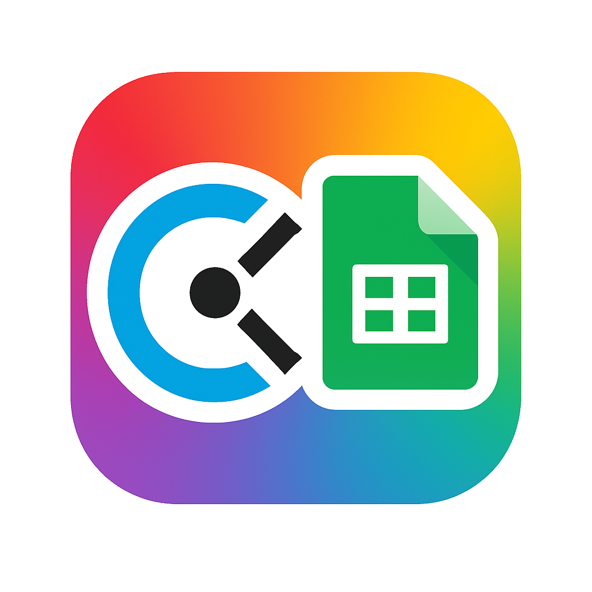

<p align="center">
  
</p>

# Clocki2GSheet

Clocki2GSheet is a desktop app for macOS that exports monthly data from Clockify to Google Sheets, organized in monthly tabs (`YYYY-MM`).  
It features a simple GUI built with Tkinter—no terminal needed.

## ✅ Features

- Export Clockify time entries for a specific month and year
- Create (or update) a dedicated tab for each month in the target Google Sheet
- Authenticate using a Google Service Account (no OAuth flow)
- External configuration file, editable even after compiling the app

## 📁 File Structure

```
Clocki2GSheet.app/
config.py
service_account.json
```

## ⚙️ Configuration

Create a `config.py` file in the same folder as the `.app`, with the following variables:

```python
CLOCKIFY_API_KEY = "xxx"
CLOCKIFY_WORKSPACE_ID = "xxx"
GOOGLE_SHEET_EXPORT_FILE_ID = "xxx"
```

Place the `service_account.json` file from your Google Service Account in the same folder.

Ensure that both the Google Sheet file and its containing Drive folder are **shared with the Service Account email**.

## 🚀 How to Run

1. Double-click the `Clocki2GSheet.app`
2. Enter the desired month and year
3. Click "Export"
4. Data will be written into the `"YYYY-MM"` tab of the configured Google Sheet

## 🧱 For Developers (Build the .app)

### 1. Create Virtual Environment

```bash
python3 -m venv venv
source venv/bin/activate
pip install -r requirements.txt
```

### 2. Build the App

```bash
pyinstaller --windowed clockify_export_gui.py --name "Clocki2GSheet"
```

### 3. Final Distribution Structure

```
dist/
├── Clocki2GSheet.app
├── config.py
└── service_account.json
```

**You don't need to use the `--onefile` flag.**

## 🛡️ Common Issues

- If macOS blocks the app: right-click > Open > "Open Anyway"
- If the GUI doesn't open: run the app from Terminal to see error logs

## 📝 License

MIT
